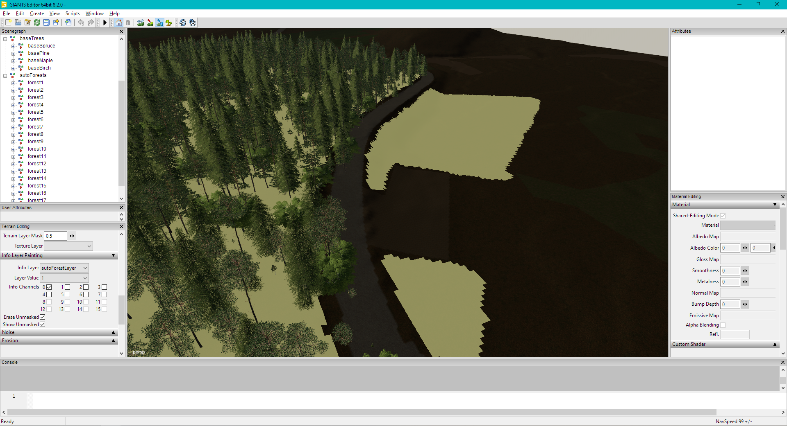

# Automatic forest creation

### installation
1. install python, see [Python Installation](../python_installation.md)
1. open a commmand/terminal window and navigate to script location
1. run `python3 -m pip install -r requirements/requirements.txt`

### configuration options
#### overview
most configurations are done via the xml or the shp file, depending on your `baseTrees` transform groups, add a 
`wgt<Name>` for each of your `base<Name` transform groups. see the following image for an example of GE's transform 
groups:   

Format: ![an example image showing a transform group named `baseTres` and one transform group per tree species under it]

##### base tree sets and ages
within each `base<Name>` group (referred to in code as species) there will be a transform group per age similar to:
```
baseTrees
  + baseSpruce
    + spruce_stage1
    + spruce_stage2
```

the names of the ages must match the species name in all lower case as shown above with the format `<name>_stage<age>`

##### the autoForests transform group
in your i3d file, add a autoForests transform group as shown above with no children transform groups, this is where
the script will store your forests, one forest will be created per image value/layer channel painted

** !! warning: anything within this transform group will be overwritten at runtime !! **

##### xml properties and species weights

the process is virtually identical for shp and xml, see [the example xml](resources/forests.xml) for a preview but 
there are a few required attributes that are needed for this to work properly. (xml and png will be referred to from
here, but the same goes for shp/tif)
2. each xml row must have a unique id corresponding to a value in the PNG, if the xml does not contain a value that is
in the PNG, that value will be skipped from processing
2.  `minSize` and `maxSize` must exist and be set to an integer, these correspond to the ages of the trees to generate
if a tree does not have all the ages, that is fine, the most restrictive range will be used. for example if a `minSize` 
of 2 and `maxSize` is set to 6 for a tree that only has (up to) age 5, simply (up to) age 5 will be used
2. `densMult` must be provided, this determined how thick the forest is, values around 0.3 to 0.6 are usually good, 
values above 0.6 (60%) are possible but not recommended, it will result in _a lot_ of trees. values from as low as 0.1
have been tested to work fine.
2. per species weights:
  1. there must be an entry per species in the `baseTrees`, they must be formatted as `wgt<Name>` for a `base<Species>` 
  transform group. examples: `basePine` -> `wgtPine`, `basemaple` -> `wgtmaple`, `base_tomato` -> `wgt_tomato`
  1. a decimal value must be provided between 0 -> 1
  1. the sum of all weights for a forest must equal 1.0, if the sum does not equal one, 
  the default weights will be applied that are log10 based
  
##### PNG/tif file
the provided file should be the same size as your DEM/terrain file (1024, 2048, etc) if it is not the same things should
still work provided it's smaller (the extra pixel GE adds to the DEM is ok). 

> if you are working with geospatial tools:
> this can be a georeferenced file but the values should be explorted as if they are in meters (use UTM)

### running the script
open [run.py](../../generate/forests/) in a text editor or python IDE. set values as defined in the file
that reference your i3d file and the input files. the DEM file path will be read from the i3d so no need to worry about
it provided it is a PNG file. if it is not, then please convert that to a PNG.

> Note: only 16 bit single band DEM and 8 bit single band forests image files have been tested, multiband images may
> cause unforeseen issues. please convert multiband (RGB/RGBA) images to grayscale 16 bit images before use

with all parameters set and files created, back up your project and run the script in the IDE or with the following 
command `python3 ./run.py`
you will see output similar to:
```
processing forest #1
pruning values...
pruned 4194304
Probabilities:
baseSpruce: 90.0%
basePine: 10.0%
baseMaple: 0.0%
baseBirch: 0.0%
masking grid...
``` 

> pruning takes a while, this is normal while the script eliminates trees that would be adjacent to one another, 
> trees can still be close when the script completes, but no two trees should be closer than 1m at the center location.
> for more details on the implementation see the `prune_neighbors` function in forestGenerator.py

if the forest reports 0 trees, double check your id matches the values in the PNG band 1 or that pixels exist
matching value

once the program completes a "done" statement will be printed and python will exit. if an error is reported please
check the above steps before creating an issue. data may be needed to troubleshoot the issue if it is a code problem